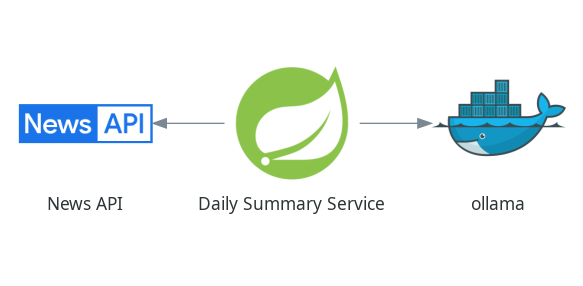

# 📰 News Summary Intelligence API




A production-grade, highly-observable microservice built to provide AI-driven news summaries. This project demonstrates **Clean Architecture** (Hexagonal) principles, integrating **Local LLMs** via **Spring AI**, distributed tracing, and high-performance caching.

### 🧩 Component Breakdown

Under the high-level architecture, the **🍃 Daily Summary Service** operates as a **Coordinator Pattern** across two distinct technical boundaries:

* **📰 News API (The Data Provider):** Acts as the **Driven Output Adapter**. It consumes real-time headlines filtered by country. By using a dedicated `ReadNewsOutputPort`, the core is shielded from third-party API changes.
* **🐳 Ollama (The AI Provider):** The **Secondary Output Adapter**. Leveraging the latest **Spring AI** libraries, it interfaces with a local **Mistral:7b** model to generate human-readable summaries entirely on-premise, ensuring data privacy.
---

## 🏗 Architecture & Design

### Hexagonal Architecture (Ports & Adapters)
To ensure the business logic remains decoupled from infrastructure, the project follows a strict Hexagonal pattern:

* **Domain:** Core entities and logic (e.g., `News`).
* **Application (Ports):**
    * *Input Port:* `GetNewsSummaryInputPort` defining the summary use case.
    * *Output Port:*
        * `ReadNewsOutputPort` for News retrieval.
        * `SummaryOutputPort` for AI generation.
* **Infrastructure (Adapters):**
    * **Input:** 
      * REST Controller (`NewsResource`) with **OpenAPI 3 / Swagger** documentation. 
      * **Global Error Handling:** Implemented via **@RestControllerAdvice**, ensuring all exceptions (AI timeouts, API failures, Validation errors) are mapped to consistent, type-safe REST responses.
    * **Output:** **Spring AI** implementation for **Ollama**, External News Clients, and **Caffeine** for local caching.

## 🛠 Technical Stack

| Category             | Technology                                                      |
|:---------------------|:----------------------------------------------------------------|
| **Language**         | Java 21 (LTS)                                                   |
| **Framework**        | Spring Boot 4.0 / Spring 7 / Spring AI (2.0.0-SNAPSHOT)         |
| **AI Engine**        | Ollama (Model: `mistral:7b`)                                    |
| **Observability**    | Micrometer Observation + Zipkin(via OTLP) + **Spring Actuator** |
| **Caching**          | **Caffeine Cache**                                              |
| **Resiliency**       | **@RestControllerAdvice** (Global Error Handling)               |
| **Mapping**          | **MapStruct** & **Lombok**                                      |
| **Documentation**    | **OpenAPI 3 / Swagger UI**                                      |
| **Code Quality**     | **JaCoCo** (Test Coverage Reports)                              |
| **Containerization** | **Docker** (Multi-stage efficient builds)                       |

## 📂 Project Structure
```
src
├── main
│   ├── java/com/echocano/ai/news
│   │   ├── domain                                <-- Business Entities (News.java)
│   │   ├── application                           <-- The Hexagon Core
│   │   │   ├── port                              # Strategy Interfaces
│   │   │   │   ├── input                         # Driver Ports (API contracts)
│   │   │   │   └── output                        # Driven Ports (SPI for external services)
│   │   │   ├── usecase                           # Business Logic Implementation
│   │   │   │   └── NewsUseCase.java              # Coordinates NewsAPI and Ollama
│   │   │   ├── mapper                            # Data transformations (MapStruct)
│   │   │   ├── exceptions                        # Domain-specific error types
│   │   │   └── validators                        # Custom validations
│   │   ├── infrastructure                        <-- Technical Details (Adapters)
│   │   │   └── adapter
│   │   │       ├── input                         # Primary Adapters (REST API)
│   │   │       │   ├── config                    # Framework settings (Swagger, Cache)
│   │   │       │   ├── dto                       # Web Request/Response objects
│   │   │       │   ├── INewsResource.java        # API Documentation Interface
│   │   │       │   ├── NewsResource.java         # Controller Implementation
│   │   │       │   └── RestExceptionHandler.java # Global Errors
│   │   │       └── output                        # Secondary Adapters
│   │   │           ├── newsapi                   # NewsAPI.org implementation
│   │   │           └── ollama                    # AI Summary implementation
│   │   └── SummaryNewsServiceApplication.java
│   └── resources                                 # Environment Configurations
└── test                                          <-- Unified Testing Suite
    └── java/com/echocano/ai/news
        ├── application/usecase                   # Unit Tests for Business Logic
        └── infrastructure/adapter                # Integration & Client Tests
```

## 🚀 Getting Started

### 1. Prerequisites
* **Java 21 JDK** & **Maven**.
* **Docker & Docker Compose**.
* **Ollama** installed and running (`ollama serve`).
* **IntelliJ IDEA** (Recommended with *Lombok* plugin enabled).
* **NewsAPI Key:** Get one for free at [newsapi.org](https://newsapi.org/)

### 2. Configuration & Environment Setup

The **Daily Summary Service** requires two primary environment variables to interface with the external News provider and the local LLM.

| Variable          | Default Value                | Description                                                   |
|:------------------|:-----------------------------|:--------------------------------------------------------------|
| **`NEWS_APIKEY`** | *Required*                   | Your unique API Key from [newsapi.org](https://newsapi.org/). |
| **`OLLAMA_URL`**  | `http://127.0.0.1:11434/api` | The endpoint for your local **Ollama** instance.              |

#### 📝 Local Setup
For local development, you can define these in your shell or a `.env` file (ensure `.env` is in your `.gitignore`):

```bash
# API-KEY -> NEWS API Service
export NEWS_APIKEY=your_news_api_key_here

# OLLAMA API URL
export OLLAMA_URL=http://127.0.0.1:11434/api
```

Run the environment using the optimized Docker Compose file:

```bash
# Set your local models path
# export OLLAMA_MODELS_PATH=~/.ollama

# Pull the AI model
ollama pull mistral:7b

# Start Zipkin and infrastructure
docker compose up -d
```

## 🐳 Dockerization & Deployment

### Efficient Multi-stage Build
The project features a professional-grade `Dockerfile` optimized for Spring Boot 4:
* **Layered Jars:** Uses `layertools` to separate dependencies and application code for optimal layer caching.
* **Security:** Implements a dedicated non-root `spring` user.
* **JVM Tuning:** Configured with `-XX:MaxRAMPercentage=75.0` for container awareness.

### Container Orchestration
* **Development (`docker-compose.yml`):** Uses `lifecycle.management=start-only` for Ollama to ensure the LLM stays warm during app restarts. Includes GPU acceleration support.
* **Production (`docker-compose-prod.yml`):** A fully isolated network stack where the API communicates with `ollama-prod` internally.

## 🔌 API Documentation & Health

* **Swagger UI:** `http://localhost:8080/swagger-ui.html`
* **Health Check:** `http://localhost:8080/actuator/health` (Reports UP/DOWN status of NewsAPI and Disk)
* **Tracing UI:** `http://localhost:9411` (Zipkin Dashboard for performance bottlenecks)

---

## ⚡ Quick Test (Usage)
Once the service is running, you can request a summary for a specific country using `curl`:

```bash
curl -X POST http://localhost:8080/api/v1/news/summary \
     -H "Content-Type: application/json" \
     -d '{"country": "us"}'
```

---

## 🧪 Testing & Quality Assurance

* **Integration Testing:** Verified via `@SpringBootTest` and `MockMvc`, including specific fixes for `HttpMessageNotWritableException` and `LocalDate` serialization.
* **Test Coverage:** Run `./mvnw test` to generate the **JaCoCo** report.
* **Report Location:** `target/site/jacoco/index.html`

---

## 📈 Performance & Monitoring

### ⚡ Edge Caching Strategy (Caffeine)
The service implements a high-performance caching layer at the **REST Controller** level to provide an immediate "Short-Circuit" for redundant requests:
* **Resource Preservation:** Prevents unnecessary downstream calls to both the **External News API** (saving API quota) and the **Ollama LLM** (saving GPU/CPU cycles).
* **Latency Reduction:** Responses for cached Country/Date combinations are served in sub-millisecond time, bypassing the entire Hexagonal execution flow.
* **Profile-Aware TTL:** 
    * **Development:** 5-minute expiry for rapid iteration.
    * **Production:** 12-hour expiry to maximize stability and minimize AI inference costs.
* **Observability:** Integrated with **Spring Actuator** and `.recordStats()` to monitor hit/miss ratios and memory footprint in real-time.

### 🔍 Distributed Tracing & Observability (Zipkin)
The service implements a high-fidelity tracing strategy to monitor the high-latency lifecycle of AI inference and external data retrieval.

* **Spring Boot 4 & OpenTelemetry Standard:** Built on the **Spring 7** observability stack, utilizing **Micrometer Tracing** and the **OTLP** (OpenTelemetry Protocol) bridge to ensure vendor-neutral telemetry.
* **Granular Inference Spans:** Provides deep visibility into the "Thinking Time" of the **Ollama (Mistral)** model versus the I/O latency of the **External News API**.
* **Virtual Thread Context Propagation:** Specifically engineered to ensure **Trace IDs** are successfully "handed off" across **Java 21 Virtual Thread** boundaries, preventing data gaps during asynchronous execution.
* **Error-Trace Correlation:** Integrated with the **`@RestControllerAdvice`** to inject the active `traceId` directly into error responses. This allows developers to instantly correlate a client-side error with a specific server-side bottleneck in the Zipkin UI.
* **Live Dashboard:** Access the request lifecycle at `http://localhost:9411`.

### 🚀 High-Efficiency Mapping (MapStruct & Lombok)
Maintains strict separation between Domain models and REST DTOs with zero runtime overhead:
* **Zero Reflection:** **MapStruct** generates optimized Java code at compile-time for lightning-fast object conversion.
* **Type Safety:** Ensures all data transformations are validated during the build process, preventing runtime mapping errors.
* **Clean Code:** Leverages **Lombok** to eliminate boilerplate, keeping the focus on core business logic.

## 💻 IntelliJ IDEA Integration
1. **Annotation Processing:** Enable in `Settings > Build > Compiler > Annotation Processors`.
2. **Services Tool Window:** Docker Compose is integrated for direct log viewing and container management.

---

## 🤝 Credits & Inspiration
The initial project idea and the caching implementation strategy originated from the [**@LeetJourney**](https://www.youtube.com/@LeetJourney) YouTube channel.

**Architectural Evolution:** This repository represents a complete re-engineering of that idea, adding **Clean Architecture (Hexagonal)**, **Observability**, **Containerization**, and **Spring AI** integration to create a scalable, professional-grade microservice.

### 📝 Author
**Elthon Chocano** - Software Engineer

### 📄 License

This project is licensed under the **MIT License** - see the [LICENSE](docs/LICENSE.md) file for details.